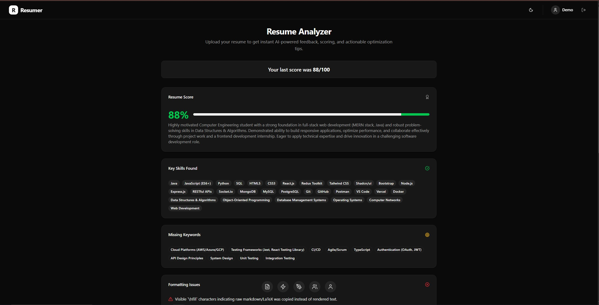
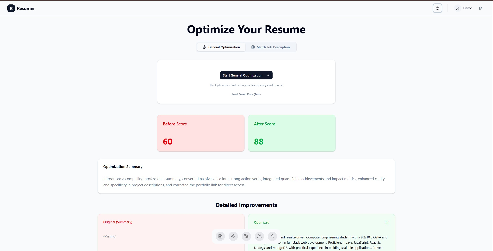
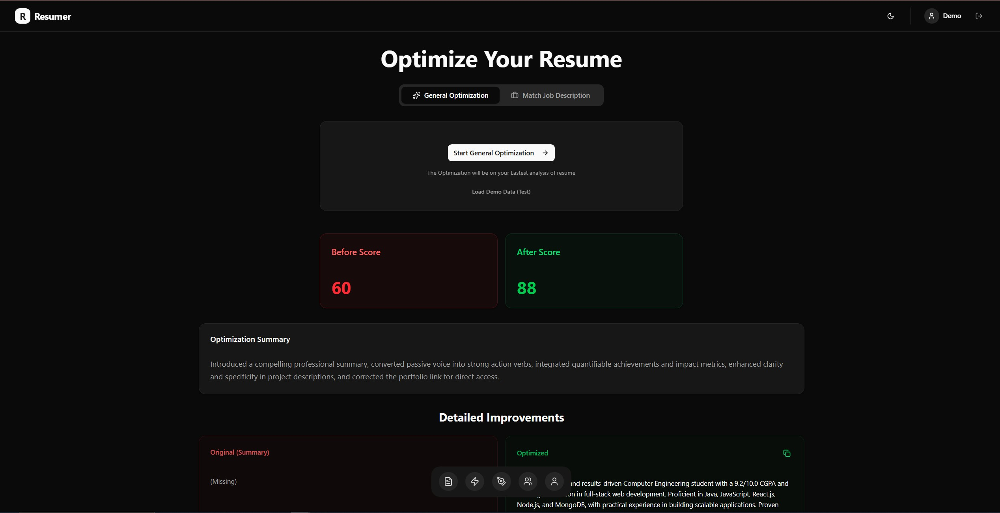
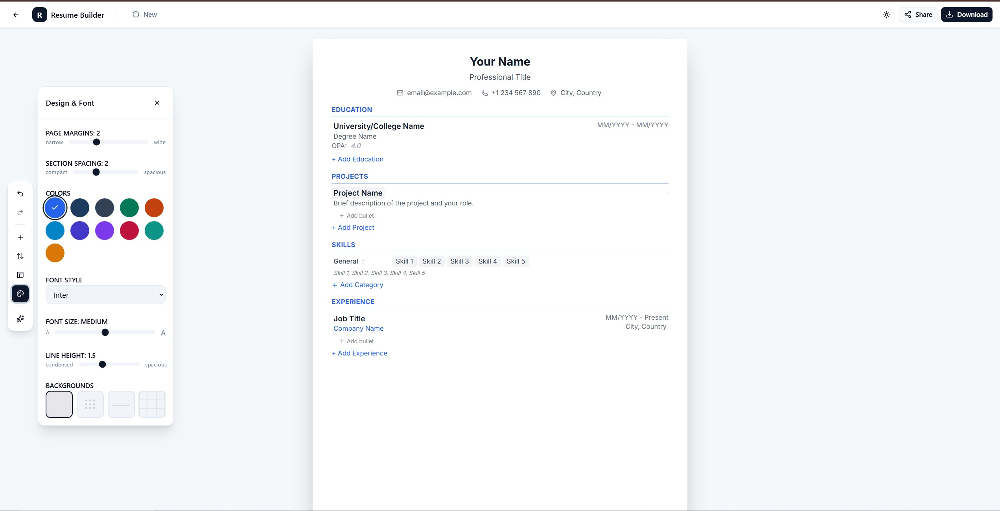

<div align="center">

# Resumer | AI Resume Optimizer

**Build, Analyze, and Optimize Your Resume with AI Precision**

[](https://www.typescriptlang.org/)
[](https://react.dev/)
[](https://vitejs.dev/)
[](https://expressjs.com/)
[](https://www.mongodb.com/)
[](https://tailwindcss.com/)

[Live Demo](https://resumer.vercel.app) · [Report Bug](https://github.com/Bhavesh-Solminde/resumer/issues) · [Request Feature](https://github.com/Bhavesh-Solminde/resumer/issues)

</div>

---

## ✨ Features

### 📊 AI-Powered Resume Analysis

- **ATS Score Calculation** — Get an instant Applicant Tracking System compatibility score (0-100)
- **Structured Feedback** — Receive detailed analysis including summary, key skills, missing keywords, formatting issues, and actionable tips
  

- **PDF Parsing** — Upload any PDF resume for intelligent text extraction and analysis

<div align="center">
  
  
</div>

### 🚀 Smart Optimization Engine
<div align="center">

</div>
- **General Optimization** — Enhance your resume with AI-suggested improvements for clarity, impact, and professionalism
- **Job Description Matching** — Tailor your resume to specific job postings with targeted keyword optimization
- **Before/After Comparison** — Visual red/green diff comparison showing exactly what changed and why
- **One-Click Copy** — Copy optimized sections directly to your clipboard

### 🛠️ Resume Builder
<div align="center">

</div>
- **Drag-and-Drop Editor** — Intuitive section-based resume builder with real-time preview
- **Multiple Templates** — Choose from professional templates (Modern, Classic, Minimal, Creative)
- **Customizable Styling** — Adjust fonts, colors, spacing, and layout to match your personal brand
- **Section Management** — Add, remove, and rearrange sections (Experience, Education, Skills, Projects, Certifications)
- **Undo/Redo Support** — Full history tracking powered by Zundo temporal middleware
- **PDF Export** — Generate polished, ATS-friendly PDF resumes with `@react-pdf/renderer`

### 👤 User Profile & History

- **Secure Authentication** — JWT-based auth with OAuth support (Google, GitHub)
- **Scan History** — Access all previous resume analyses and optimizations
- **Resume Library** — Manage multiple resume versions for different job applications
- **Cloud Storage** — All resumes securely stored on Cloudinary with automatic thumbnail generation

### 🎨 Modern UI/UX

- **Dark/Light Theme** — Seamless theme switching with CSS variables
- **Responsive Design** — Fully responsive layouts for desktop, tablet, and mobile
- **Animated Components** — Beautiful animations powered by Aceternity UI and Framer Motion
- **Accessible** — Built with accessibility best practices

---

## 🏗️ Architecture

```
resumer/
├── frontend/                 # React 18 + Vite + TypeScript
│   ├── src/
│   │   ├── components/       # UI components (Shadcn + Aceternity)
│   │   │   ├── ui/           # Base UI primitives
│   │   │   ├── analyze/      # Analysis feature components
│   │   │   ├── builder/      # Resume builder components
│   │   │   └── profile/      # User profile components
│   │   ├── pages/            # Route pages
│   │   ├── store/            # Zustand state management
│   │   ├── hooks/            # Custom React hooks
│   │   └── lib/              # Utilities & axios instance
│   └── ...
├── backend/                  # Express + TypeScript (ES Modules)
│   ├── src/
│   │   ├── controllers/      # Route handlers
│   │   ├── models/           # Mongoose schemas
│   │   ├── middlewares/      # Auth, upload, etc.
│   │   ├── routes/           # Express routers
│   │   ├── passport/         # OAuth strategies
│   │   └── lib/              # DB & Cloudinary setup
│   └── ...
├── packages/
│   └── shared-types/         # Shared TypeScript types
└── pnpm-workspace.yaml       # Monorepo configuration
```

---

## 🛠️ Tech Stack

| Layer          | Technology                                                  |
| -------------- | ----------------------------------------------------------- |
| **Frontend**   | React 18, Vite 6, TypeScript, React Router v7               |
| **Styling**    | Tailwind CSS v4, Shadcn UI, Aceternity UI, Framer Motion    |
| **State**      | Zustand + Zundo (temporal middleware for undo/redo)         |
| **Backend**    | Node.js, Express 4, TypeScript (ES Modules)                 |
| **AI Engine**  | Google Gemini 2.0 Flash                                     |
| **Database**   | MongoDB with Mongoose ODM                                   |
| **Storage**    | Cloudinary (PDFs & thumbnails)                              |
| **Auth**       | JWT (HttpOnly cookies) + Passport.js (Google, GitHub OAuth) |
| **PDF Export** | @react-pdf/renderer                                         |
| **Monorepo**   | pnpm workspaces                                             |

---

## 📡 API Reference

### Authentication

| Method | Endpoint                | Description                    |
| ------ | ----------------------- | ------------------------------ |
| POST   | `/api/v1/auth/register` | Create new user account        |
| POST   | `/api/v1/auth/login`    | Login with email/password      |
| POST   | `/api/v1/auth/logout`   | Logout and clear cookies       |
| POST   | `/api/v1/auth/refresh`  | Refresh access token           |
| GET    | `/api/v1/auth/me`       | Get authenticated user profile |
| PATCH  | `/api/v1/auth/password` | Update password                |
| GET    | `/api/v1/auth/google`   | Google OAuth initiation        |
| GET    | `/api/v1/auth/github`   | GitHub OAuth initiation        |

### Resume Analysis & Optimization

| Method | Endpoint                     | Description                              |
| ------ | ---------------------------- | ---------------------------------------- |
| POST   | `/api/v1/resume/analyze`     | Upload PDF & get AI analysis + ATS score |
| POST   | `/api/v1/resume/optimize`    | General resume optimization              |
| POST   | `/api/v1/resume/optimize/jd` | Job description-specific optimization    |

### Resume Builder

| Method | Endpoint            | Description                       |
| ------ | ------------------- | --------------------------------- |
| POST   | `/api/v1/build`     | Create new resume draft           |
| GET    | `/api/v1/build`     | Fetch user's resume build history |
| GET    | `/api/v1/build/:id` | Fetch specific resume by ID       |
| PATCH  | `/api/v1/build/:id` | Update resume (auto-save)         |
| DELETE | `/api/v1/build/:id` | Delete a resume                   |

### Profile & History

| Method | Endpoint                   | Description               |
| ------ | -------------------------- | ------------------------- |
| GET    | `/api/v1/profile/history`  | Get resume scan history   |
| GET    | `/api/v1/profile/scan/:id` | Get specific scan details |

---

## 🚀 Getting Started

### Prerequisites

- **Node.js** >= 18.x
- **pnpm** >= 8.x
- **MongoDB** (local or Atlas)
- **Cloudinary** account
- **Google Gemini API** key

### Installation

```bash
# Clone the repository
git clone https://github.com/Bhavesh-Solminde/resumer.git
cd resumer

# Install dependencies
pnpm install
```

### Environment Setup

**Backend (`backend/.env`)**

```env
NODE_ENV=development
PORT=4000
MONGODB_URI=mongodb://localhost:27017/resumer
JWT_SECRET=your-super-secret-jwt-key
JWT_REFRESH_SECRET=your-super-secret-refresh-key

# Google Gemini
GEMINI_API_KEY=your-gemini-api-key

# Cloudinary
CLOUDINARY_CLOUD_NAME=your-cloud-name
CLOUDINARY_API_KEY=your-api-key
CLOUDINARY_API_SECRET=your-api-secret

# OAuth (optional)
GOOGLE_CLIENT_ID=your-google-client-id
GOOGLE_CLIENT_SECRET=your-google-client-secret
GITHUB_CLIENT_ID=your-github-client-id
GITHUB_CLIENT_SECRET=your-github-client-secret

# Frontend URL (for CORS & OAuth callbacks)
FRONTEND_URL=http://localhost:5173
```

**Frontend (`frontend/.env`)**

```env
VITE_API_BASE_URL=http://localhost:4000/api/v1
```

### Development

```bash
# Run both frontend and backend concurrently
pnpm dev

# Or run separately:
pnpm --filter backend dev     # Backend on port 4000
pnpm --filter frontend dev    # Frontend on port 5173
```

### Build for Production

```bash
# Build all packages
pnpm build

# Or build separately:
pnpm --filter backend build
pnpm --filter frontend build
```

---

## 🎨 Design System

### Color Tokens

The app uses semantic CSS variables for seamless light/dark theme switching:

| Token                | Usage                     |
| -------------------- | ------------------------- |
| `--background`       | Page backgrounds          |
| `--foreground`       | Primary text              |
| `--card`             | Card backgrounds          |
| `--card-foreground`  | Card text                 |
| `--primary`          | Primary actions & accents |
| `--muted`            | Subtle backgrounds        |
| `--muted-foreground` | Secondary text            |
| `--border`           | Borders & dividers        |
| `--destructive`      | Error states              |

### Component Library

- **Shadcn UI** — Button, Card, Dialog, Input, Textarea, Switch, Progress, Tabs, etc.
- **Aceternity UI** — Hero Highlight, Bento Grid, Infinite Moving Cards, Background Beams/Stars, Floating Dock
- **Custom** — Multi-step Loader, Resume Editor, Section Components

---

## 📁 Project Structure

```
├── frontend/
│   ├── src/
│   │   ├── pages/
│   │   │   ├── LandingPage.tsx      # Marketing landing page
│   │   │   ├── Login.tsx            # Authentication
│   │   │   ├── Signup.tsx           # User registration
│   │   │   ├── Analyze.tsx          # Resume analysis
│   │   │   ├── Optimize.tsx         # Resume optimization
│   │   │   ├── ResumeBuilder.tsx    # Drag-and-drop builder
│   │   │   ├── Profile.tsx          # User dashboard
│   │   │   └── NotFound.tsx         # 404 page
│   │   ├── components/
│   │   │   ├── builder/
│   │   │   │   ├── BuilderHeader.tsx
│   │   │   │   ├── BuilderSidebar.tsx
│   │   │   │   ├── ResumeEditor.tsx
│   │   │   │   ├── DesignPanel.tsx
│   │   │   │   ├── sections/        # Editable section components
│   │   │   │   ├── modals/          # Add section, rearrange, templates
│   │   │   │   ├── pdf/             # PDF generation components
│   │   │   │   └── templates/       # Resume template definitions
│   │   │   └── ...
│   │   ├── store/
│   │   │   ├── Auth.store.ts        # Authentication state
│   │   │   ├── Build.store.ts       # Resume builder state + undo/redo
│   │   │   ├── Resume.store.ts      # Analysis & optimization state
│   │   │   ├── History.store.ts     # Scan history state
│   │   │   └── slices/              # Store slice modules
│   │   └── hooks/
│   │       └── usePDFExport.tsx     # PDF generation hook
│   └── ...
├── backend/
│   ├── src/
│   │   ├── controllers/
│   │   │   ├── auth.controllers.ts
│   │   │   ├── analyze.controllers.ts
│   │   │   ├── optimize.controllers.ts
│   │   │   ├── build.controllers.ts
│   │   │   └── profile.controllers.ts
│   │   ├── models/
│   │   │   ├── user.model.ts
│   │   │   ├── resumeScan.model.ts
│   │   │   └── resumeBuild.model.ts
│   │   ├── middlewares/
│   │   │   ├── auth.middleware.ts
│   │   │   └── memory.middleware.ts
│   │   └── passport/
│   │       ├── google.strategy.ts
│   │       └── github.strategy.ts
│   └── ...
└── packages/
    └── shared-types/                # Shared TypeScript interfaces
        └── src/
            ├── api.types.ts
            ├── user.types.ts
            ├── scan.types.ts
            ├── build.types.ts
            └── sections.types.ts
```

---

## 🔒 Security

- **JWT in HttpOnly Cookies** — Tokens are never exposed to JavaScript
- **Password Hashing** — bcrypt with salt rounds
- **CORS Protection** — Strict origin validation
- **Input Validation** — Server-side validation on all endpoints
- **Rate Limiting** — API rate limiting to prevent abuse
- **PII Safety** — Resume text is never logged; only hashed indicators for debugging

---

## 🧪 Testing & Quality

- **TypeScript Strict Mode** — Full type safety across frontend and backend
- **ESLint** — Configured for both workspaces
- **Error Handling** — All async controllers wrapped with `asyncHandler`
- **API Responses** — Consistent `ApiResponse` / `ApiError` helpers

---

## 📦 Deployment

### Frontend (Vercel)

```bash
pnpm --filter frontend build
# Deploy dist/ to Vercel
```

### Backend (Render / Railway / Fly.io)

```bash
pnpm --filter backend build
# Deploy with start command: node dist/server.js
```

---

## 🤝 Contributing

Contributions are welcome! Please read our [Contributing Guide](./CONTRIBUTING.md) for details.

1. Fork the repository
2. Create your feature branch (`git checkout -b feature/amazing-feature`)
3. Commit your changes (`git commit -m 'Add amazing feature'`)
4. Push to the branch (`git push origin feature/amazing-feature`)
5. Open a Pull Request

---

## 📄 License

This project is licensed under the MIT License — see the [LICENSE](./LICENSE) file for details.

---

<div align="center">

**Built with ❤️ by [Bhavesh Solminde](https://github.com/Bhavesh-Solminde)**

⭐ Star this repo if you found it helpful!

</div>
