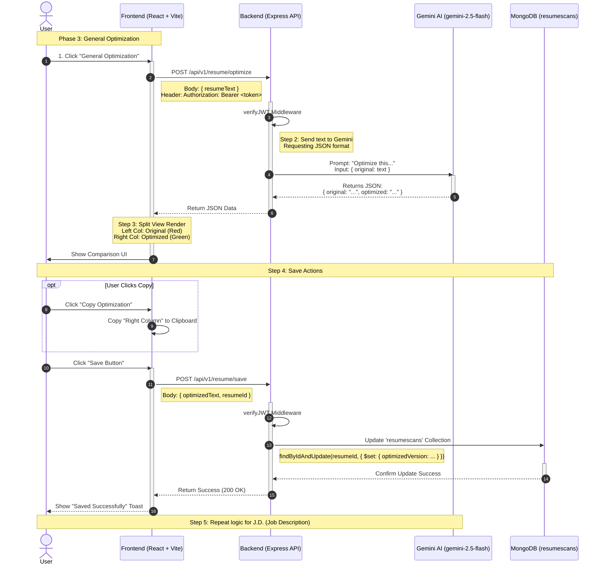

```mermaid
sequenceDiagram
    autonumber
    
    %% Define Actors matching your architecture
    actor User
    participant FE as Frontend (React + Vite)
    participant BE as Backend (Express API)
    participant AI as Gemini AI (gemini-2.5-flash)
    participant DB as MongoDB (resumescans)

    %% --- PART 1: OPTIMIZATION (Steps 1-3) ---
    Note over User, FE: Phase 3: General Optimization
    
    User->>FE: 1. Click "General Optimization"
    activate FE
    
    FE->>BE: POST /api/v1/resume/optimize
    Note right of FE: Body: { resumeText }<br/>Header: Authorization: Bearer <token>
    activate BE
    
    BE->>BE: verifyJWT Middleware
    
    Note right of BE: Step 2: Send text to Gemini<br/>Requesting JSON format
    BE->>AI: Prompt: "Optimize this..."<br/>Input: { original: text }
    activate AI
    
    AI-->>BE: Returns JSON:<br/>{ original: "...", optimized: "..." }
    deactivate AI
    
    BE-->>FE: Return JSON Data
    deactivate BE
    
    Note over FE: Step 3: Split View Render<br/>Left Col: Original (Red)<br/>Right Col: Optimized (Green)
    FE->>User: Show Comparison UI
    deactivate FE

    %% --- PART 2: SAVE & COPY (Step 4) ---
    Note over User, DB: Step 4: Save Actions
    
    opt User Clicks Copy
        User->>FE: Click "Copy Optimization"
        FE->>FE: Copy "Right Column" to Clipboard
    end

    User->>FE: Click "Save Button"
    activate FE
    FE->>BE: POST /api/v1/resume/save
    Note right of FE: Body: { optimizedText, resumeId }
    activate BE
    
    BE->>BE: verifyJWT Middleware
    
    BE->>DB: Update 'resumescans' Collection
    Note right of BE: findByIdAndUpdate(resumeId, { $set: { optimizedVersion: ... } })
    activate DB
    DB-->>BE: Confirm Update Success
    deactivate DB
    
    BE-->>FE: Return Success (200 OK)
    deactivate BE
    FE-->>User: Show "Saved Successfully" Toast
    deactivate FE

    %% --- PART 3: REPEAT (Step 5) ---
    Note over User, AI: Step 5: Repeat logic for J.D. (Job Description)
```
